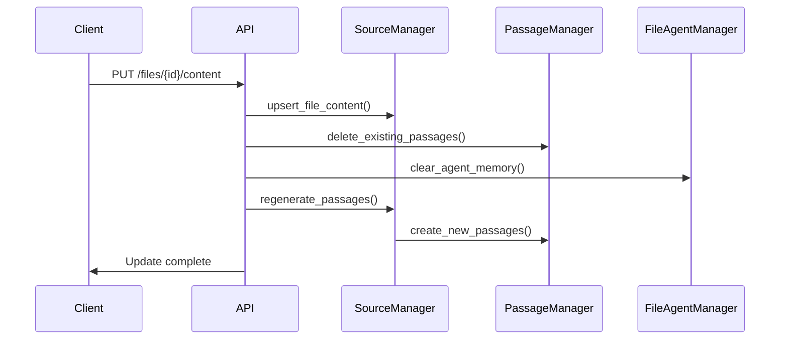

# Updating File Content in Letta

This document describes how to update file content in Letta when source files change, particularly useful for scenarios like SharePoint files that are actively being modified.

## Overview

Letta supports updating file content while preserving source structure and agent attachments. When a file is updated, the system:

1. Updates the file content in the database
2. Regenerates vector embeddings and passages
3. Clears agent memory to force fresh content loading
4. Maintains file metadata and associations

## API Endpoints

### 1. Update File Content

**Endpoint:** `PUT /api/v1/sources/{source_id}/files/{file_id}/content`

**Request Body:**
```json
{
  "content": "Updated file content as plain text",
  "force_reprocess": true,
  "clear_agent_memory": true
}
```

**Response:**
```json
{
  "success": true,
  "file_id": "file_abc123",
  "processing_status": "completed",
  "passages_updated": 15,
  "agents_affected": 2
}
```

### 2. Check File Processing Status

**Endpoint:** `GET /api/v1/sources/{source_id}/files/{file_id}/status`

**Response:**
```json
{
  "file_id": "file_abc123",
  "processing_status": "completed",
  "last_updated": "2025-01-06T10:30:00Z",
  "error_message": null,
  "passage_count": 15
}
```

### 3. List File Versions (if versioning enabled)

**Endpoint:** `GET /api/v1/sources/{source_id}/files/{file_id}/versions`

**Response:**
```json
{
  "versions": [
    {
      "version": 2,
      "updated_at": "2025-01-06T10:30:00Z",
      "content_hash": "sha256:abc123...",
      "passage_count": 15
    },
    {
      "version": 1,
      "updated_at": "2025-01-06T09:00:00Z",
      "content_hash": "sha256:def456...",
      "passage_count": 12
    }
  ]
}
```

## Implementation Example

### SharePoint Integration

```python
import asyncio
from letta.client import LettaClient
from letta.schemas.file import FileMetadata
from letta.schemas.enums import FileProcessingStatus

async def update_sharepoint_file(
    sharepoint_file_id: str,
    letta_source_id: str,
    letta_file_id: str,
    new_content: str
):
    """Update a SharePoint file in Letta when it changes."""
    
    client = LettaClient()
    
    # 1. Update file content
    response = await client.update_file_content(
        source_id=letta_source_id,
        file_id=letta_file_id,
        content=new_content,
        force_reprocess=True,
        clear_agent_memory=True
    )
    
    # 2. Monitor processing status
    while True:
        status = await client.get_file_status(letta_source_id, letta_file_id)
        
        if status.processing_status == FileProcessingStatus.COMPLETED:
            print(f"File updated successfully. {status.passage_count} passages generated.")
            break
        elif status.processing_status == FileProcessingStatus.ERROR:
            print(f"Update failed: {status.error_message}")
            break
        
        await asyncio.sleep(2)  # Poll every 2 seconds
    
    return response
```

### Webhook Integration

```python
from fastapi import FastAPI, HTTPException
from pydantic import BaseModel

app = FastAPI()

class SharePointWebhook(BaseModel):
    file_id: str
    download_url: str
    modified_time: str

@app.post("/webhook/sharepoint")
async def handle_sharepoint_update(webhook: SharePointWebhook):
    """Handle SharePoint file update webhook."""
    
    try:
        # 1. Download updated file content
        content = await download_file_from_sharepoint(webhook.download_url)
        
        # 2. Find corresponding Letta file
        letta_mapping = await get_letta_file_mapping(webhook.file_id)
        
        # 3. Update in Letta
        await update_sharepoint_file(
            sharepoint_file_id=webhook.file_id,
            letta_source_id=letta_mapping.source_id,
            letta_file_id=letta_mapping.file_id,
            new_content=content
        )
        
        return {"status": "success", "message": "File updated"}
        
    except Exception as e:
        raise HTTPException(status_code=500, detail=str(e))
```

## Update Process Details

### 1. Content Update Flow



### 2. Database Changes

When a file is updated, the following database changes occur:

1. **FileContent table:** Text content is updated via upsert
2. **SourcePassage table:** Old passages are deleted, new ones created
3. **FileMetadata table:** `updated_at` timestamp and processing status updated
4. **FileAgent table:** `is_open=false` and `visible_content=null` for all agents

### 3. Agent Impact

When files are updated:

- **Active file sessions:** Agents with the file open will have their memory cleared
- **Search results:** New vector embeddings ensure accurate semantic search
- **Tool operations:** `open_file` will show updated content on next access
- **Context preservation:** Agent conversation history remains intact

## Best Practices

### 1. Conflict Resolution

```python
# Check if file is currently being accessed by agents
agents_with_file = await client.list_agents_with_file(source_id, file_id)

if agents_with_file and not force_update:
    return {
        "warning": "File is currently open by active agents",
        "affected_agents": [agent.id for agent in agents_with_file],
        "recommendation": "Consider updating during low activity periods"
    }
```

### 2. Batch Updates

For multiple file updates:

```python
async def batch_update_files(updates: List[FileUpdate]):
    """Update multiple files efficiently."""
    
    # Group by source for optimal processing
    by_source = {}
    for update in updates:
        if update.source_id not in by_source:
            by_source[update.source_id] = []
        by_source[update.source_id].append(update)
    
    # Process each source's files together
    results = []
    for source_id, file_updates in by_source.items():
        source_results = await update_source_files(source_id, file_updates)
        results.extend(source_results)
    
    return results
```

### 3. Error Handling

```python
async def robust_file_update(source_id: str, file_id: str, content: str):
    """Update file with comprehensive error handling."""
    
    try:
        # Backup current state
        backup = await client.get_file_content(source_id, file_id)
        
        # Attempt update
        result = await client.update_file_content(
            source_id=source_id,
            file_id=file_id,
            content=content
        )
        
        # Verify success
        status = await client.get_file_status(source_id, file_id)
        if status.processing_status == FileProcessingStatus.ERROR:
            # Restore backup if update failed
            await client.update_file_content(
                source_id=source_id,
                file_id=file_id,
                content=backup.content
            )
            raise Exception(f"Update failed: {status.error_message}")
        
        return result
        
    except Exception as e:
        logger.error(f"File update failed: {e}")
        raise
```

## Performance Considerations

### 1. Large Files

- **Chunking:** Large files are automatically chunked during passage generation
- **Streaming:** Consider streaming updates for files >10MB
- **Background processing:** Updates are processed asynchronously

### 2. Frequency Limits

- **Rate limiting:** Implement delays between updates for the same file
- **Debouncing:** Batch rapid successive updates within time windows
- **Cache warming:** Pre-generate embeddings for frequently updated files

### 3. Resource Usage

```python
# Monitor resource usage during updates
async def monitor_update_performance(source_id: str, file_id: str):
    start_time = time.time()
    
    result = await client.update_file_content(source_id, file_id, content)
    
    metrics = {
        "duration": time.time() - start_time,
        "passages_generated": result.passages_updated,
        "agents_affected": result.agents_affected,
        "memory_usage": get_memory_usage()
    }
    
    logger.info(f"Update performance: {metrics}")
    return result
```

## Limitations

1. **Version History:** Currently no built-in file versioning (can be implemented separately)
2. **Concurrent Updates:** Multiple simultaneous updates to the same file may conflict
3. **Rollback:** No automatic rollback mechanism for failed updates
4. **Agent Notifications:** Agents are not automatically notified of file changes

## Migration from Static Files

If migrating from static file uploads to dynamic updates:

```python
async def migrate_to_dynamic_files():
    """Convert static file sources to support dynamic updates."""
    
    sources = await client.list_sources()
    
    for source in sources:
        files = await client.list_files(source.id)
        
        for file in files:
            # Add update metadata
            await client.update_file_metadata(
                source_id=source.id,
                file_id=file.id,
                metadata={
                    "supports_updates": True,
                    "external_id": file.external_reference,
                    "last_sync": datetime.utcnow().isoformat()
                }
            )
```

This enables dynamic content updates while preserving existing agent attachments and conversation history.